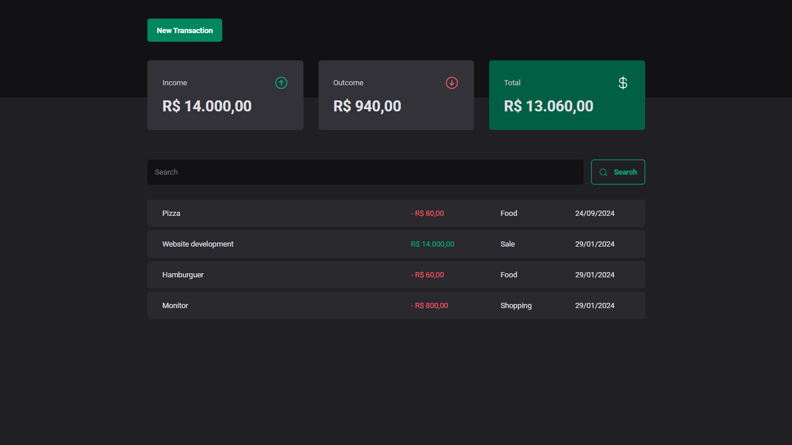

<a href="https://github.com/whosramoss/react-money">
  
  <h1 align="center">React Money</h1>
</a>

<p align="center">
  Financial tracker: records incomes and expenses
</p>

<div align="center">
  
  
  
  <br/>
  
  
  
  
    
       
</div>
<br/>

<br/>


## How to install 

```bash
  # Clone the project
  git clone https://github.com/whosramoss/react-money/

  # Go to the project directory
  cd react-money

  # Install dependencies
  npm install
```

## How to run 
```bash
  # Start the app 
  npm run dev

  # Start the server 
  npm run dev:server
```

## How to build 
- Run the command:
```bash
  npm run build
```

## Contributing 
If you want to contribute to `react-money`, please make sure to review the [contribution guidelines](https://github.com/whosramoss/react-money/blob/master/CONTRIBUTING.md). This project makes use of [GitHub issues](https://github.com/whosramoss/react-money/issues) for
tracking requests and bugs.

## License 

MIT License. [LICENSE](./LICENSE)

## Author 

Gabriel Ramos ([@whosramoss](https://github.com/whosramoss))

